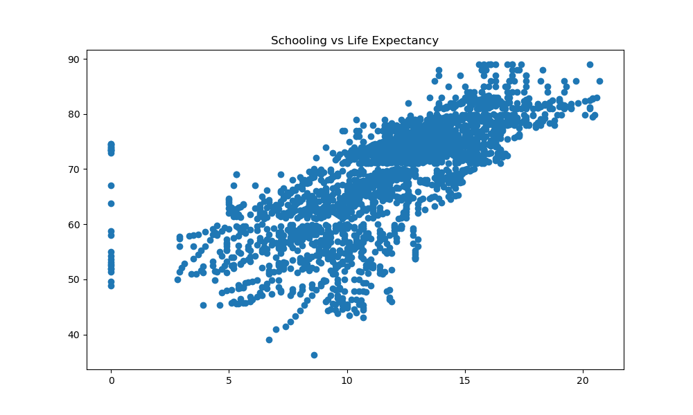

# Practice Project

#### Repo Contents
- [Notebooks Folder](https://github.com/mattcarr17/practice-repo/tree/main/notebooks)

#### Table of Contents
- Project Overview
- Data
- Data Exploration
- [Modeling](#modeling)
- [Results](#results)

## Project Overview
Modeling project aimed at predicting life expectancy of a country and understanding influence of various features.

#### Conda Environment

To run through the code in this project, you must first download and activate the conda environment. From the root of this project repo, run the following commands:

- `conda env create -f environment.yml`
- `conda activate practice-env`

## Data
Dataset provides information on multiple countries over fifteen year period. Target variable is average life expectancy of a single country for a given year. Includes multiple influential factors of life expectancy.

Dataset can be found via [Kaggle](https://www.kaggle.com/datasets/kumarajarshi/life-expectancy-who)

## Data Exploration

Began by exploring relationship between life expectancy and highest correlated feature, average years of schooling.

Looking at image above, we can a relatively strong positive correlation between average years of schooling and average life expectancy.

## Modeling

Description of models

## Results

## Next Steps